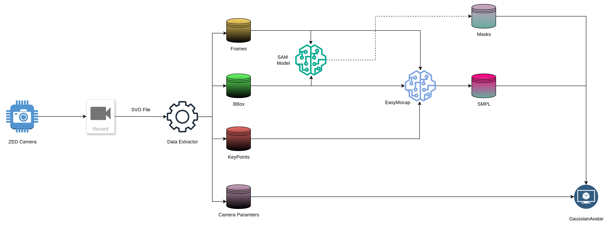
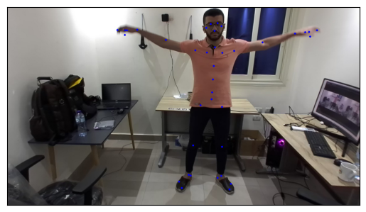
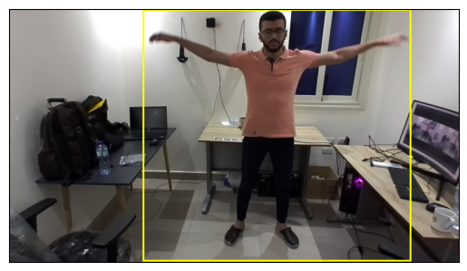
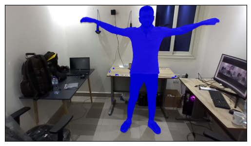
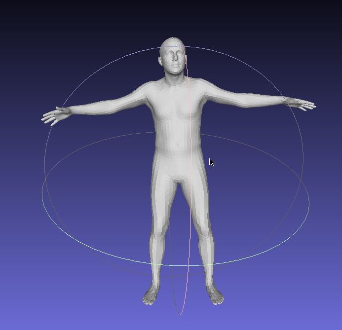

# **3D-AVA: ZED-to-GaussianAvatar Data Pipeline**

## 🧠 Overview

**3D-AVA** is a modular pipeline that transforms **ZED camera recordings** into high-quality, SMPL-based human representations suitable for training **GaussianAvatar** — a state-of-the-art neural rendering model based on 3D Gaussians.

It extracts and packages synchronized **RGB frames**, **depth data**, **keypoints**, **segmentation masks**, **camera parameters**, and **SMPL parameters** — all formatted for neural avatar generation.



---

## 🛰️ **Step 1: Capture — ZED Camera → SVO File**

The **ZED stereo camera** records synchronized **RGB-D video**, depth maps, and inertial data, saved in ZED’s proprietary `.svo` format.

✅ **Output:**

* `.svo` file (contains RGB frames, depth, IMU, and timestamped metadata)

---

## 🧩 **Step 2: Data Extraction — SVO → Structured Data**

Using the ZED SDK, the pipeline extracts synchronized data streams from `.svo` into usable formats:

| Output              | Description                                               |
| ------------------- | --------------------------------------------------------- |
| `Frames`            | RGB images extracted per frame                            |
| `BBox`              | Bounding boxes from the Object Detection module           |
| `KeyPoints`         | 2D keypoints from the Body Tracking module (ZED38 format) |
| `Camera Intrinsics` | Per-frame intrinsic + extrinsic matrices                  |

Each output supports a downstream module and enables frame-wise annotation consistency.

🖼 **Sample Output:**

<div style="display: flex; gap: 20px;">
  
  
</div>

---

## 🖼️ **Step 3: Segmentation — Segment Anything (SAM)**

Uses Meta AI’s **Segment Anything Model (SAM)** to generate fine-grained human silhouettes.

🧾 **Input:**

* RGB `Frames`
* Corresponding `Bounding Boxes`

🎯 **Output:**

* Binary `Masks` (segmenting the human subject)

🖼 **Example Output:** 



---

## 🧍 **Step 4: SMPL Estimation — EasyMocap**

**EasyMocap** reconstructs a full **3D SMPL model** from image-space annotations.

📥 **Input:**

* `Frames`, `BBox`, and `KeyPoints`

🧠 **Process:**

* Uses optimization and inverse kinematics to regress the SMPL model

📤 **Output:**

* `betas`: Body shape (10D)
* `poses`: Joint pose angles (axis-angle format)
* `Rh`: Global orientation
* `Th`: Global translation

This is the **canonical 3D representation** used by GaussianAvatar for consistent geometry and animation.

🖼 **Example Output:** 



## 🧊 **Step 5: Packaging for GaussianAvatar**

The pipeline assembles all assets required to train **GaussianAvatar**:

| Asset                       | Purpose                                          |
| --------------------------- | ------------------------------------------------ |
| `SMPL Params (.npz/.pth)`   | Canonical body geometry and motion               |
| `Segmentation Masks (.png)` | silhouette supervision for photorealism |
| `Camera Intrinsics (.npy)`  | Accurate projection of 3D Gaussians to 2D frame  |
| `RGB Frames (.png)`         | Ground truth supervision of color and structure  |

---

## 🎯 **Final Output: Training-Ready Dataset**

At the end, the following are exported:

📦 **Directory structure:**

```
└── subject_name/
    ├── images/           # RGB frames
    ├── masks/            # Segmentation masks 
    ├── smpl_parms.pth    # Pose, shape, global orientation, translation
    ├── cam_intrinsics.npy
```

## 🧪 Experimental Outcome & Reflection

After implementing the full **3D-AVA pipeline** and generating a dataset using ZED recordings, I used the output to train the **GaussianAvatar** model.

### ❌ Initial Attempt (ZED-Based Dataset):

Despite substantial effort to run and adapt the **official GaussianAvatar source code**, the training results using the **ZED + EasyMocap + SAM pipeline** were **unsatisfactory**:

* SMPL alignment issues with frames — likely due to **EasyMocap misregistration** or **camera mismatch**
* Time-intensive debugging due to the complexity and lack of modularity in the original codebase
* Produce empty rendered images 
---

### ✅ Successful Attempt (Alternate Dataset: M4)

To validate the training pipeline, I switched to an official dataset called **M4** (part of the original GaussianAvatar repo or community benchmarks).

* Successfully trained **GaussianAvatar** end-to-end using M4 data 180 Epochs
* Managed to **animate the avatar** with clean geometry and realistic rendering
* Demonstrated the full cycle from training to rendering and motion

### Demo of Rendered Human
https://github.com/user-attachments/assets/c368982c-98bc-448e-8285-429230581af9

## How to Run

### Prerequisites

1. A ZED camera or a recorded `.svo` file.
2. Install the [ZED SDK v4.2](https://www.stereolabs.com/en-eg/developers/release/4.2).
3. Install [uv](https://github.com/astral-sh/uv).

---

### Step 1: Install Dependencies

1. Create a virtual environment and install project dependencies from `pyproject.toml`:
    ```bash
    uv venv
    uv sync
    ```

2. Activate the virtual environment:
    ```bash
    source .venv/bin/3d-ava
    ```

3. Install the ZED Python bindings:
    ```bash
    uv run src/zed-config/install-pyzed.py
    ```

4. Make the project editable (for proper imports):
    ```bash
    uv pip install -e .
    ```

---

### Step 2: Data Acquisition

1. Extract data from an `.svo` file:
    ```bash
    uv run src/zed/main.py \
      --input_svo_file {YOUR-FILE_PATH} \
      --enable_od \
      --enable_body_tracking \
      --extract_keypoints \
      --save \
      --save_cam
    ```
    Output will be saved under:
    ```bash
    /PROJECT_DIR/.data/experiments/EXP_{NUM}
    ├── bodies
    ├── camera
    ├── depth-maps
    └── images
    ```

2. Clean incomplete data entries (frames missing any modality):
    ```bash
    uv run src/data/trim_entries.py --exp_path {YOUR-EXP-PATH}
    ```

3. Extract bounding boxes from raw body data:
    ```bash
    uv run src/data/extract_bbox.py --exp_path {YOUR-EXP-PATH}
    ```
    Directory structure after this step:
    ```bash
    .
    ├── bbox
    ├── bodies
    ├── camera
    ├── depth-maps
    └── images
    ```

4. Generate segmentation masks for each frame:
    ```bash
    uv run src/data/extract_mask.py --exp_path {YOUR-EXP-PATH}
    ```
    Resulting structure:
    ```bash
    .
    ├── bbox
    ├── bodies
    ├── camera
    ├── depth-maps
    ├── images
    └── masks
    ```

5. Extract 38-joint keypoints from body data:
    ```bash
    uv run src/data/extract_keypoint.py --exp_path {YOUR-EXP-PATH}
    ```
    Updated structure:
    ```bash
    .
    ├── bbox
    ├── bodies
    ├── camera
    ├── depth-maps
    ├── images
    └── keypoints
    ```

6. Generate EasyMocap-compatible annotations:
    ```bash
    uv run src/data/create_easymocap_data.py --exp_path {YOUR-EXP-PATH}
    ```
    Final structure:
    ```bash
    .
    ├── annots
    ├── bbox
    ├── bodies
    ├── camera
    ├── depth-maps
    ├── images
    └── keypoints
    ```

### Step 3: Create SMPL meshes

1. Install EasyMocap

        ```bash
        git clone https://github.com/zju3dv/EasyMocap.git

        conda create -n easymocap python=3.9 -y

        conda activate easymocap

        wget -c https://download.pytorch.org/whl/cu116/torch-1.12.0%2Bcu116-cp39-cp39-linux_x86_64.whl

        python3 -m pip install ./torch-1.12.0+cu116-cp39-cp39-linux_x86_64.whl

        wget -c https://download.pytorch.org/whl/cu116/torchvision-0.13.0%2Bcu116-cp39-cp39-linux_x86_64.whl

        python3 -m pip install ./torchvision-0.13.0+cu116-cp39-cp39-linux_x86_64.whl
        ```

    open requirements file and delete from it mediapip then add to the end of the file these requirements

        ```Plaintext
        mediapipe
        seaborn
        ```
    ---

        ```bash

        python -m pip install -r requirements.txt

        pip install spconv-cu116

        # install pyrender if you have a screen
        python3 -m pip install pyrender

        python setup.py develop
        ```

    then set this enviroment variable 
    ```bash
        export PROTOCOL_BUFFERS_PYTHON_IMPLEMENTATION=python
    ```
    finally downgrade numpy 
    ```bash
    pip uninstall numpy
    pip install numpy==1.23.5
    ```
2. Edit file `myeasymocap/backbone/pare/pare.py` line `250` to this line
    ```python
    state_dict = torch.load(ckpt, map_location='cpu',weights_only=False)['state_dict']

    ``` 

3. Edit the configuration file `config/datasets/svimage.yml` to be something like this
    ```yaml
    module: myeasymocap.datasets.sv1p.SVDataset
    args:
    root: /kaggle/working/EasyMocap/.data/experiments/EXP_9 # Full path to the dataset
    subs: ['']  
    ranges: [0, 10000, 1] 
    read_image: True 
    reader:
        images:
            root: images
            ext: .png
        image_shape:
            root: images
            ext: .png
    ```
4. Run the fitting module using this command
    ```bash
    emc --data config/datasets/svimage.yml \    
        --exp config/1v1p/hrnet_pare_finetune.yml \
        --root {PATH-TO-DATA} \
        --out output/{ANY-TH}
    ```
### Step 4:  Train GaussianAvatar 
by following the steps provided on this fork you can easily train and animate the avatar!
[GaussianAvatar](https://github.com/ahmedelsayed968/GaussianAvatar)
## 🗂️ Curated Dataset (Public)

After iterating through each stage and refining the pipeline, a curated dataset is now available:

📁 **Download:**
[🔗 Google Drive - 3D-AVA Curated Dataset](https://drive.google.com/drive/folders/1-hMFWdiqAjLKhnenDnekbF3DM5Pyxkzs?usp=sharing)


